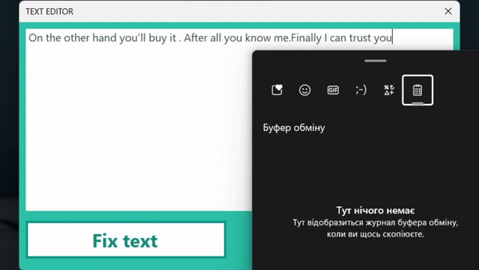

# Text Editor application

### How does it work?
You can submit your text and then you'll get in return corrected text with ability to copy it.
Also you can start from the beginning after clicking on button "Restart".

### Is it useful?
You'll get your text: 
- without redundant spaces before dots and commas
- with commas after introductory words
- with spaces after dots and commas
So application basically formats your text.

### How it looks like:

### Tecnical info
It's a Windows Forms Application which contains JSON file with introductory words. 
Button "Fix text" has two stages. I control these stages with help of bool variable. 
I have methods for enabling and disabling buttons and methods for correcting text. 
I guess, project will grow in future (I have an idea of replacing abbreviations etc), so I'll add some new features later.
